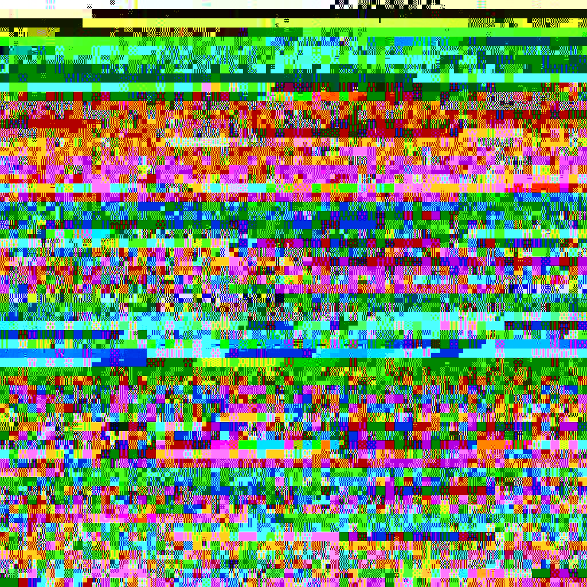
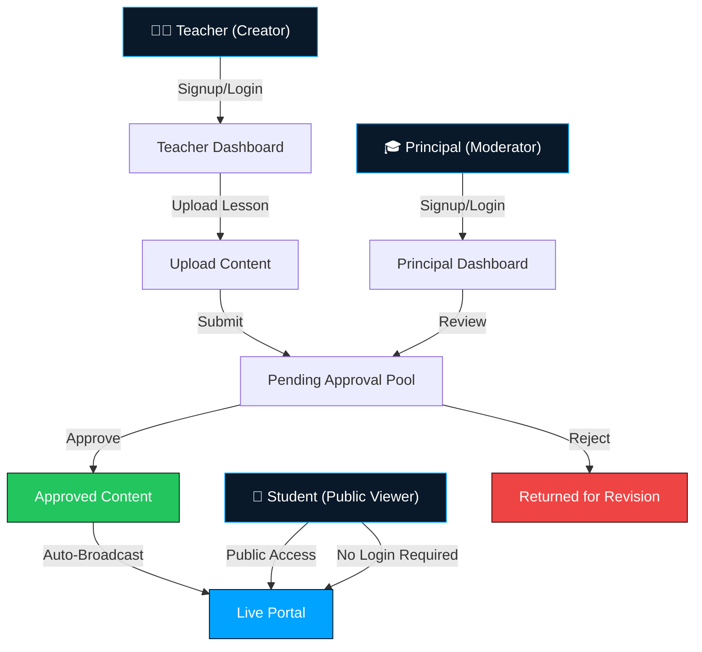
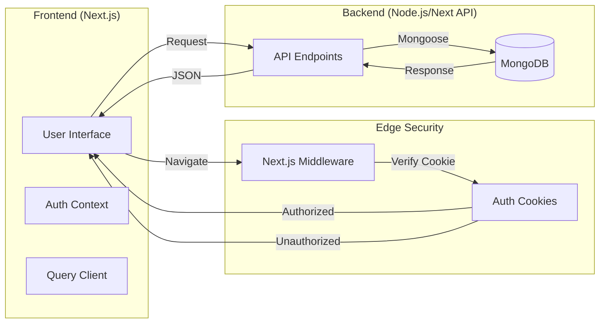

# 🐾 ScholarCast | Institutional Command Center

ScholarCast is a high-performance, secure content broadcasting system designed for modern educational environments. It synchronizes institutional knowledge through a multi-tier approval workflow, ensuring that only verified academic content reaches the public live portal.

---

## 📂 Folder Structure

```text
📁 ScholarCast
├── 📁 public           # Static assets (logos, images, diagrams)
│   └── 📁 docs         # System diagrams and documentation images
├── 📁 src
│   ├── 📁 app          # Next.js App Router (Pages, Layouts, APIs)
│   │   ├── 📁 api      # Server-side API endpoints
│   │   ├── 📁 live     # Public Live Environment subroutes
│   │   ├── 📁 principal# Principal moderation tools
│   │   └── 📁 teacher  # Educator content management
│   ├── 📁 components   # Shared UI & Layout components
│   ├── 📁 context      # Global state (Authentication, etc.)
│   ├── 📁 hooks        # Custom data fetching hooks
│   ├── 📁 lib          # Core utilities & configurations
│   ├── 📁 models       # MongoDB data schemas
│   └── 📁 services     # Business logic & API integration layer
├── 📄 middleware.js    # Server-side access control (Edge)
├── 📄 components.json  # Shadcn UI configuration
└── 📄 tailwind.config.js
```

---

## 📊 System Workflow

The following flowchart illustrates the user journey and content lifecycle within the ScholarCast ecosystem.





---

## 🏗️ Architectural Flow

ScholarCast leverages a modern full-stack architecture with a focus on security, performance, and real-time synchronization.




---

## 🚀 Key Features

- **Multi-Tier Authorization**: Distinct dashboards for Teachers (Content Creators) and Principals (Content Moderators).
- **Curriculum Lifecycle Management**: Structured flow from content upload to administrative review and final broadcast.
- **Student-First Live Portal**: Publicly accessible gateway for students to witness curriculum in real-time without friction (no login required).
- **Brutalist Design System**: A high-contrast, premium aesthetic optimized for institutional authority and cross-device responsiveness.
- **Server-Side Security**: Middleware-level route protection ensures that functional tools remain private while public resources are easily accessible.

---

## 🛠️ Tech Stack

- **Frontend**: [Next.js 15+](https://nextjs.org/) (App Router)
- **Styling**: [Tailwind CSS 4.0](https://tailwindcss.com/)
- **Animations**: [Framer Motion](https://www.framer.com/motion/)
- **Database**: [MongoDB](https://www.mongodb.com/) with [Mongoose](https://mongoosejs.com/)
- **Data Fetching**: [TanStack Query v5](https://tanstack.com/query/latest)
- **Icons**: [Lucide React](https://lucide.dev/)
- **UI Components**: [Shadcn UI](https://ui.shadcn.com/)

---

## 📦 Getting Started

### 1. Clone the repository
```bash
git clone https://github.com/risshhubh/ScholarCast.git
```

### 2. Install dependencies
```bash
npm install
```

### 3. Environment Setup
Create a `.env` file in the root directory:
```env
MONGODB_URI=your_mongodb_connection_string
JWT_SECRET=your_secret_key
```

### 4. Run Development Server
```bash
npm run dev
```

---

## 🛡️ Governance & Standards
ScholarCast adheres to the highest standards of institutional integrity. Every broadcast is logged, every user is verified, and the curriculum is protected by state-of-the-art security protocols.

© 2026 ScholarCast Institutional. All Signal Rights Reserved.
